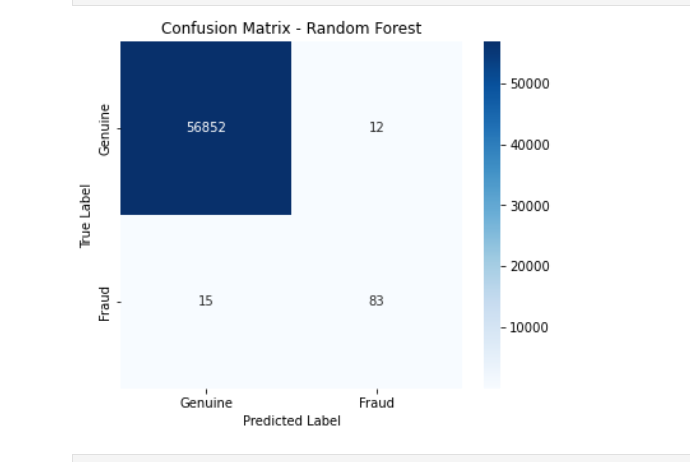
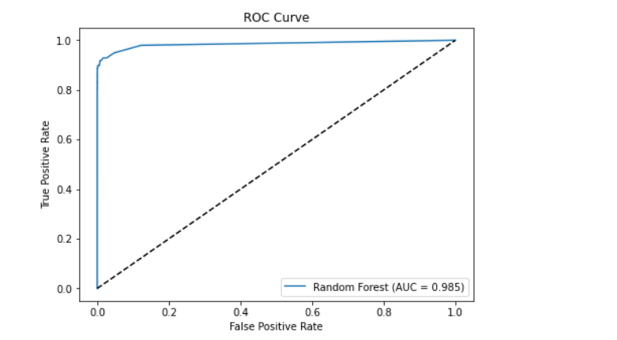
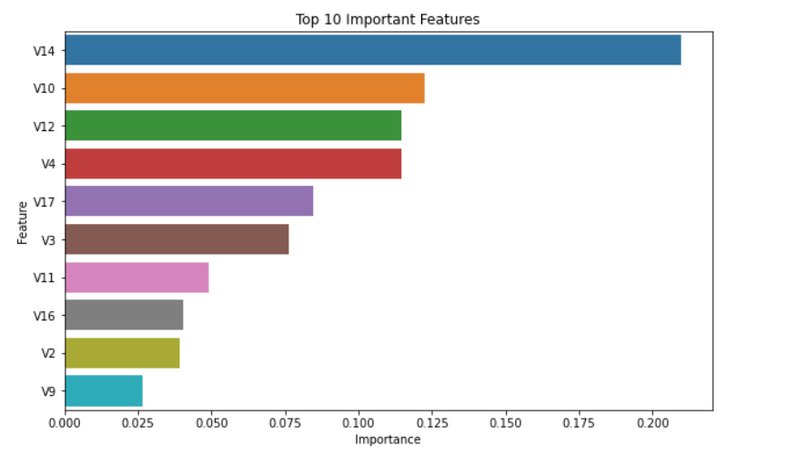
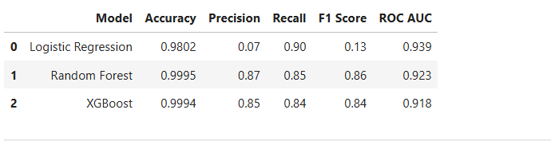

# 💳 Credit Card Fraud Detection using Machine Learning

> An end-to-end Machine Learning project for detecting fraudulent credit card transactions using data preprocessing, SMOTE, and multiple classification algorithms.

---

##  Project Overview

Credit card fraud has become one of the major challenges in the financial industry. Since fraudulent transactions represent only a very small portion of all transactions, the dataset is highly imbalanced, making fraud detection a difficult classification problem.

In this project, I developed a complete fraud detection pipeline that includes data preprocessing, exploratory data analysis (EDA), handling class imbalance using SMOTE, training multiple machine learning models, evaluating their performance, and selecting the best-performing model.

---

##  Features

- Exploratory Data Analysis (EDA)
- Data Cleaning & Preprocessing
- Feature Scaling
- Handling Imbalanced Data using SMOTE
- Model Training using:
  - Logistic Regression
  - Random Forest
  - XGBoost
- Model Comparison
- Confusion Matrix
- ROC Curve
- Feature Importance Analysis
- Model Saving using Joblib

---

## Tech Stack

- Python
- Jupyter Lab
- Pandas
- NumPy
- Matplotlib
- Seaborn
- Scikit-learn
- XGBoost
- Imbalanced-learn (SMOTE)
- Joblib

---

##  Project Structure

```
CreditCardFraudDetection
│
├── data/
│
├── models/
│   └── fraud_detection_model.pkl
│
├── notebooks/
│   ├── 01_data_exploration_and_eda.ipynb
│   ├── 02_preprocessing.ipynb
│   └── 03_model_training.ipynb
│
├── requirements.txt
├── README.md
└── .gitignore
```

---

##  Dataset Information

| Description | Value |
|------------|------:|
| Total Transactions | 284,807 |
| Genuine Transactions | 284,315 |
| Fraud Transactions | 492 |

The dataset is highly imbalanced, therefore **SMOTE** was applied on the training data before model training.

---

#  Machine Learning Workflow

1. Data Collection
2. Exploratory Data Analysis (EDA)
3. Data Preprocessing
4. Train-Test Split
5. Feature Scaling
6. SMOTE for Class Balancing
7. Model Training
8. Model Evaluation
9. Model Comparison
10. Save Best Model

---

#  Model Performance

| Model | Accuracy | Precision | Recall | F1 Score | ROC-AUC |
|------|---------:|----------:|--------:|----------:|---------:|
| Logistic Regression | 98.02% | 0.07 | **0.90** | 0.13 | **0.939** |
| Random Forest  | **99.95%** | **0.87** | **0.85** | **0.86** | **0.923** |
| XGBoost | 99.94% | 0.85 | 0.84 | 0.84 | 0.918 |

---

#  Best Model

After comparing all three models, **Random Forest** was selected as the final model because it achieved the best balance between Precision, Recall, F1-score, and Accuracy while minimizing false positives.

---

#  Project Visualizations

The project includes:

- Class Distribution
- Correlation Heatmap
- Transaction Amount Distribution
- Confusion Matrix Heatmap
- ROC Curve
- Feature Importance
- Model Comparison Graph


## Confusion Matrix



## ROC Curve



## Feature Importance



## Model Comparison




---

#  Saved Model

The final trained Random Forest model is saved as:

```
models/fraud_detection_model.pkl
```

The saved model can be loaded later for prediction without retraining.

---

# ▶ Installation

Clone the repository

```bash
git clone https://github.com/YOUR_GITHUB_USERNAME/CreditCardFraudDetection.git
```

Move to project folder

```bash
cd CreditCardFraudDetection
```

Install dependencies

```bash
pip install -r requirements.txt
```

Launch Jupyter Lab

```bash
jupyter lab
```

---

#  Future Improvements

- Hyperparameter Tuning using GridSearchCV
- Cross Validation
- Real-Time Fraud Detection API using Flask/FastAPI
- Streamlit Dashboard
- Model Deployment
- Explainable AI using SHAP

---

#  Author

**Vishal Kumar Roy **

Computer Science Engineering (Artificial Intelligence)

Interested in Machine Learning, Artificial Intelligence, Python Development, and Backend Engineering.

---

